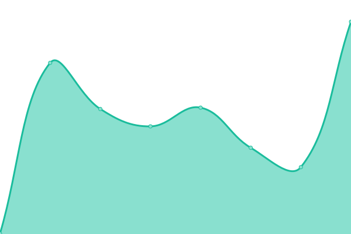
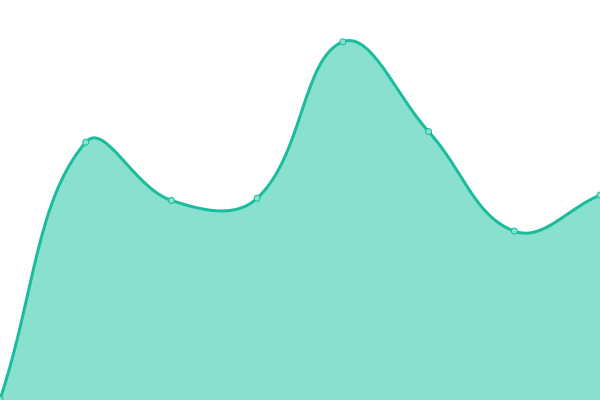

# [📈 Live Status](https://stats.hhk.my.id): <!--live status--> **🟩 All systems operational**

This repository contains the open-source uptime monitor and status page for [HHK's V/Blog](https://stats.hhk.my.id), powered by [Upptime](https://github.com/upptime/upptime).

With [Upptime](https://upptime.js.org), you can get your own unlimited and free uptime monitor and status page, powered entirely by a GitHub repository. We use [Issues](https://github.com/hhkmy/stats/issues) as incident reports, [Actions](https://github.com/hhkmy/stats/actions) as uptime monitors, and [Pages](https://stats.hhk.my.id) for the status page.

<!--start: status pages-->
<!-- This summary is generated by Upptime (https://github.com/upptime/upptime) -->
<!-- Do not edit this manually, your changes will be overwritten -->
<!-- prettier-ignore -->
| URL | Status | History | Response Time | Uptime |
| --- | ------ | ------- | ------------- | ------ |
|  [HHK](https://hhk.my.id) | 🟩 Up | [hhk.yml](https://github.com/hhkmy/stats/commits/HEAD/history/hhk.yml) | 

 307ms
     
 | 

<a href="https://stats.hhk.my.id/history/hhk">100.00%</a>
    

|  [Benchmark](https://speedlify.hhk.my.id) | 🟩 Up | [benchmark.yml](https://github.com/hhkmy/stats/commits/HEAD/history/benchmark.yml) | 

 375ms
     
 | 

<a href="https://stats.hhk.my.id/history/benchmark">100.00%</a>
    

|  [Read - Reading Contents](https://read.hhk.my.id) | 🟩 Up | [read-reading-contents.yml](https://github.com/hhkmy/stats/commits/HEAD/history/read-reading-contents.yml) | 

 280ms
     
 | 

<a href="https://stats.hhk.my.id/history/read-reading-contents">100.00%</a>
    

|  [Stats - Uptime](https://stats.hhk.my.id) | 🟩 Up | [stats-uptime.yml](https://github.com/hhkmy/stats/commits/HEAD/history/stats-uptime.yml) | 

 197ms
     
 | 

<a href="https://stats.hhk.my.id/history/stats-uptime">100.00%</a>
    

<!--end: status pages-->

[**Visit our status website →**](https://stats.hhk.my.id)

## 📄 License

- Powered by: [Upptime](https://github.com/upptime/upptime)
- Code: [MIT](./LICENSE) © [Hein Htet Kyaw](https://ksvblog.site)
- Data in the `./history` directory: [Open Database License](https://opendatacommons.org/licenses/odbl/1-0/)
